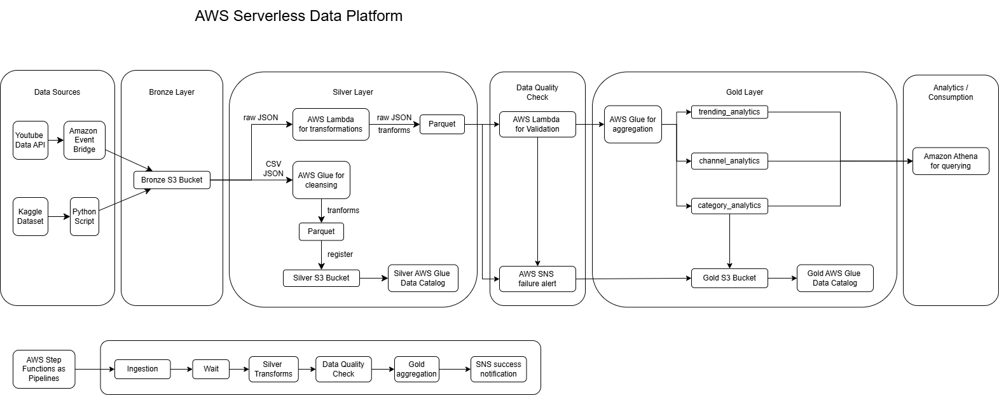

# AWS Serverless Data Platform

A production-style serverless data engineering platform built entirely on AWS that ingests YouTube Trending data, processes it using a Medallion Architecture (Bronze → Silver → Gold), performs automated data quality validation, and delivers analytics-ready datasets for querying through Amazon Athena.

Infrastructure is fully provisioned using Terraform and automatically deployed using GitHub Actions CI/CD.

---

## Architecture

<p align="center">
    
</p>

---

## Features

- Fully Serverless AWS Architecture
- Infrastructure as Code (Terraform)
- GitHub Actions CI/CD
- Medallion Architecture
    - Bronze Layer
    - Silver Layer
    - Gold Layer
- Automated Data Quality Validation
- Parallel Data Processing using AWS Step Functions
- Event-driven Scheduling with EventBridge
- Glue Data Catalog Integration
- Athena Analytics
- CloudWatch Monitoring
- SNS Failure Notifications

---

## Tech Stack

| Category | Technology |
|-----------|------------|
| Cloud | AWS |
| Infrastructure | Terraform |
| Language | Python, PySpark |
| Compute | AWS Lambda, AWS Glue |
| Orchestration | AWS Step Functions |
| Storage | Amazon S3 |
| Metadata | AWS Glue Data Catalog |
| Query Engine | Amazon Athena |
| Scheduling | Amazon EventBridge |
| Monitoring | Amazon CloudWatch |
| Alerts | Amazon SNS |
| CI/CD | GitHub Actions |

---

# Project Structure

```text
aws-serverless-data-platform/

├── .github/
│   └── workflows/
│
├── architecture/
│   └── Architecture.png
│
├── data/
│   ├── reference_category_id.json
│   └── reference_videos.csv
│
├── docs/
│
├── terraform/
│   ├── bootstrap/
│   ├── eventbridge/
│   ├── glue/
│   │   └── scripts/
│   ├── iam/
│   ├── lambda/
│   │   ├── scripts/
│   │   └── variables.tf
│   ├── s3/
│   ├── sns/
│   └── step_functions/
│
├── tests/
│   └── lambda/
│
├── README.md
└── .gitignore
```

---

# Solution Architecture

```
YouTube API
        │
        ▼
──────────────────────────
 Bronze Layer (Raw)
 Amazon S3
──────────────────────────
        │
        ▼
AWS Step Functions
        │
        ├──────────────┐
        ▼              ▼
AWS Glue         Lambda
Statistics      Reference Data
        │              │
        └──────┬───────┘
               ▼
      Silver Layer
               │
               ▼
      Data Quality Check
         (Lambda)
               │
        Pass / Fail
               │
        ┌──────┴──────┐
        ▼             ▼
 Gold Layer        SNS Alert
               │
               ▼
 Glue Catalog
               │
               ▼
 Amazon Athena
```

---

# Data Flow

## Bronze Layer

- Collects raw YouTube Trending data using YouTube Data API v3.
- Stores raw JSON data in Amazon S3.
- Maintains immutable raw datasets.

---

## Silver Layer

Transforms raw data by

- Schema validation
- Data cleansing
- Null handling
- Deduplication
- Type casting
- Reference data normalization
- Partitioned Parquet conversion

---

## Data Quality

Before data reaches Gold:

- Row Count Validation
- Schema Validation
- Null Percentage Validation
- Data Freshness Validation
- Value Range Validation

Pipeline execution stops automatically if validation fails.

---

## Gold Layer

Produces analytics-ready datasets including

- Trending Analytics
- Channel Analytics
- Category Analytics

All datasets are

- Partitioned
- Stored as Parquet
- Registered in Glue Catalog
- Queryable using Athena

---

# Infrastructure

Terraform provisions

- Amazon S3
- AWS Lambda
- AWS Glue
- AWS Step Functions
- Amazon SNS
- Amazon EventBridge
- IAM Roles & Policies
- Glue Catalog
- CloudWatch

No manual resource creation is required.

---

# CI/CD

Deployment is fully automated using GitHub Actions.

Workflow

```
Developer
      │
      ▼
Push to GitHub
      │
      ▼
GitHub Actions
      │
      ▼
Terraform Init
      │
Terraform Validate
      │
Terraform Plan
      │
Terraform Apply
      │
      ▼
AWS Infrastructure Updated
```

---

# Analytics Output

The platform generates three business-ready datasets.

### Trending Analytics

- Total Videos
- Total Views
- Like Ratio
- Engagement Rate

---

### Channel Analytics

- Total Views
- Trending Frequency
- Regional Ranking
- Engagement Rate

---

### Category Analytics

- Category Performance
- View Share
- Video Count
- Regional Distribution

---

# Monitoring

- AWS CloudWatch Logs
- SNS Failure Alerts
- Step Functions Execution History
- Glue Job Monitoring

---

# Getting Started

Clone the repository

```bash
git clone https://github.com/<username>/aws-serverless-data-platform.git
```

This repo has **no root Terraform configuration** — each folder under `terraform/`
is its own state (see `backend.tf` in each module), so `terraform init` won't do
anything useful from the repo root. Instead, run init/plan/apply **inside each
module directory**, in this order, since later modules read earlier ones via
`terraform_remote_state`:

1. `terraform/bootstrap` — one-time only, creates the state bucket + lock table
2. `terraform/s3`, `terraform/iam`, `terraform/sns` — no cross-dependencies, any order
3. `terraform/glue`, `terraform/lambda`, `terraform/step_functions` — depend on `iam`
4. `terraform/eventbridge` — depends on `iam` and `step_functions`

```bash
cd terraform/<module>
terraform init
terraform plan     # terraform/lambda additionally needs -var="youtube_api_key=<key>"
terraform apply    # terraform/lambda additionally needs -var="youtube_api_key=<key>"
```

In practice, pushing to `main` handles this ordering automatically — the GitHub
Actions workflow only applies a module when its files changed, and dependent
modules (`glue`, `lambda`, `step_functions`, `eventbridge`) wait on `iam` (and
`eventbridge` also waits on `step_functions`) via job `needs`.

---

# Skills Demonstrated

- Data Engineering
- Serverless Architecture
- Infrastructure as Code
- ETL Pipeline Development
- Medallion Architecture
- PySpark
- AWS Glue
- AWS Lambda
- AWS Step Functions
- Athena
- Terraform
- GitHub Actions
- Data Quality Engineering
- Cloud Automation

---

# Future Enhancements

- Real-time streaming with Amazon Kinesis
- Apache Iceberg support
- Amazon Redshift integration
- QuickSight dashboards
- Incremental CDC processing
- Unit testing for Glue jobs
- Terraform modules for multi-environment deployment

---

## License

This project is licensed under the MIT License.
